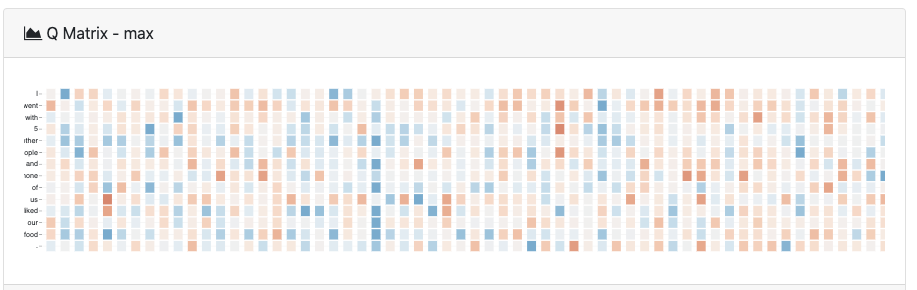
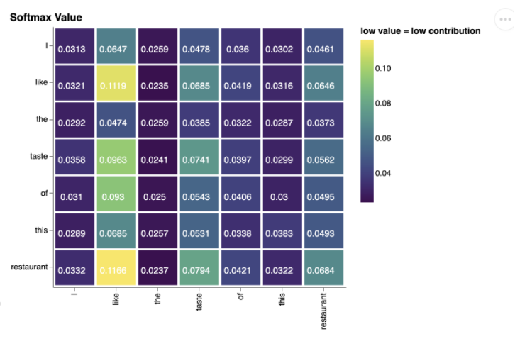

# Transformer-Vis

A Transformer visualization system for visual analysis on Attention Mechanism.

## Usage

Before you run all code, install some requirements defined in `requirements.txt`.

```bash
python -r requirements.txt
```

### Train your model

Firstly unzip the embedding file in the `./train/embeddings` folder (or use your own). 

```bash
unzip ./train/embeddings/google.zip
```

Then run the following command:

```bash
cd train
python san.py -emb embeddings/google.txt
```

The model will be stored in `./train/model` folder. Or you can download our pretrained model at [google drive](https://drive.google.com/file/d/1FMdpBNXU09o24d0GeddDJTmLSQybINai/view?usp=sharing).

The code are modefied based on [SSAN-self-attention-sentiment-analysis-classification](https://github.com/Artaches/SSAN-self-attention-sentiment-analysis-classification). To change which self-attention architecture, you can go through this repository.

### Set up visualization tool

Put the model from the previous part into `./web/static/model/`

Then run the command to start Django.

```bash
cd web
python manage.py runserver
```
Now you can use Transformers-Vis at `http://127.0.0.1:8000/`.

## Some Charts from Transofrmers-Vis

### Max matrix

Max matrix is used to detect outlier points. It will help users to find the most contributed words or dimensions in model.




### Comparison matrix

It shows softmax values which interprets how each word contributes to a word vector.



Try it to find more interesting charts! 🥳🥳


## Developers

- [Yuan Li](https://github.com/FoxerLee)
- [Mengxi Wu](https://github.com/WMX567)